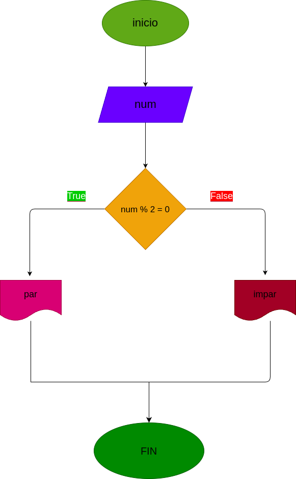

# Par_impar
Construir un programa que lea si un numero es par o impar

# Analisis

## Input

### Variables de entrada
n: número al que se desea aplicar el programa
### prosessing

si n: n % 2 = 0 se determina que es par

si n: n % 2 = 1 se determina que es impar

### output
respuesta
# Diseño

 
# Construcción
